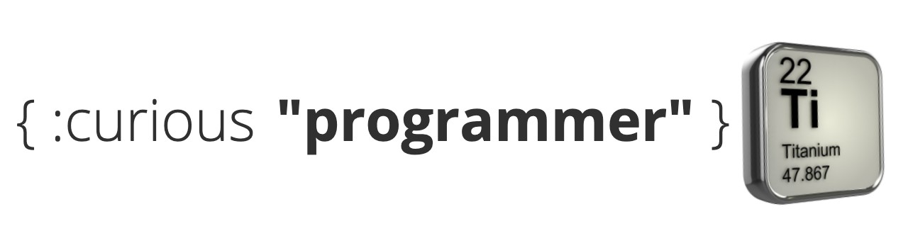

<p align="center">
  <a href="https://curiousprogrammer.dev">
    
  </a>
</p>
<div align="center">
  <a href="https://github.com/prettier/prettier">
    
  </a>
</div>

## Environment variables

```
GATSBY_ALGOLIA_APP_ID=...
GATSBY_ALGOLIA_SEARCH_KEY=...
ALGOLIA_ADMIN_KEY=...
ALGOLIA_DISABLED=...
```

## Resources

- [Image: Pixers&reg; - 3d Periodic Table](https://pngio.com/images/png-a2159734.html)
